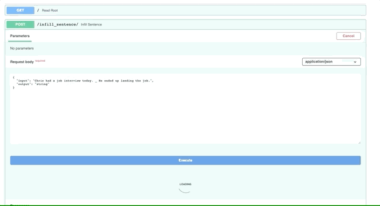

This repository houses the code for the Infilling Language Model (ILM) framework outlined in the ACL 2020 paper [Enabling language models to fill in the blanks](https://arxiv.org/abs/2005.05339) (Donahue et al. 2020).

The Git that produces this infilling output can be found [here](https://github.com/seduerr91/ilm-api). 
The instructions for deployment as a micro service on Google Cloud Engine can be found below.

## The Situation

This codebase allows you to fine tune GPT-2 to infill, i.e., perform text generation conditioned on both past and future context. For example, you could train GPT-2 to infill proper nouns in news articles, or generate lines of poetry in the middle of the stanza. 

Text infilling is the task of predicting missing spans of text which are consistent with the preceding and subsequent text. In their work, the authors present infilling by language modeling (ILM). It is a simple framework which enables LMs to infill variable-length spans while preserving their aforementioned benefits: generation quality, efficient sampling, and conceptual simplicity.

## The Task: Making ILM Available Through as a Micros Service

While BERT, a state-of-the-art model by Google (from 2018) only allows to infer one masked word, the infilling model allows to impute multiple words, sentences or documents.

## Starting with adapting the Infilling Language Model

### Infill.py

In order to have a lightweight infilling language model, all libraries, files and scripts were removed that are not related to inference. The resulting inference method was then wrapped into the 'class Infiller()' which we need for the API in 'main.py'. Fin the infill.py below.

### The main.py

We serve the uvicorn server through the main.py file with 'uvicorn main:app'. It does...

### Requirements.txt

The requirements.txt looks liek this. You run it via 'pip3 install -r requirements.txt'. It does not take much.

### The app.yaml

Gist from app.yaml is deployed via 'gcloud app deloy app.yaml'. This guide gives a very brief [introduction](https://www.tutlinks.com/deploy-fastapi-app-on-google-cloud-platform/) in how to deploy any microservice via FastAPI on Google Cloud Platform.

### The Dockerfile

The Dockerfile is being run through the app.yaml

Following instructions will allow you to run the [files](https://www.tutlinks.com/deploy-fastapi-app-on-google-cloud-platform/).

## Sources

- [Machine Learning Models with Streamlit](https://towardsdatascience.com/prototyping-machine-learning-models-with-streamlit-1134c34e9620)
- [HuggingFace Pipelines](https://huggingface.co/transformers/main_classes/pipelines.html)
- [Deploy FastAPI App on Google Cloud Platform](https://www.tutlinks.com/deploy-fastapi-app-on-google-cloud-platform/)
- [Git Infilling by Language Modeling (ILM)](https://github.com/chrisdonahue/ilm)
- [Build And Host Fast Data Science Applications Using FastAPI](https://towardsdatascience.com/build-and-host-fast-data-science-applications-using-fastapi-823be8a1d6a0)
- [Deploying Transformer Models](https://chatbotslife.com/deploying-transformer-models-1350876016f)
- [How to properly ship and deploy your machine learning model](https://towardsdatascience.com/how-to-properly-ship-and-deploy-your-machine-learning-model-8a8664b763c4)

## Acknolegdements

Thank you to Javier who suggested me to find a solution to this problem.
